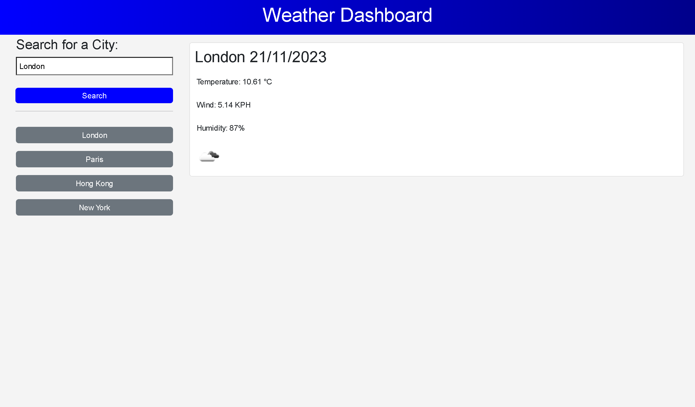

# Weather Dashboard

## Table of contents

- [Overview](#overview)
  - [The challenge](#the-challenge)
  - [Mock-up](#mock-up)
  - [Website](#website)
- [My process](#my-process)
  - [Built with](#built-with)
  - [What I learnt](#what-i-learnt)

## Overview

### The challenge
This project is to see the weather outlook for multiple cities. It currently displays the current weather status when a user searches for a city, which includes the city name, the date, an icon representation of the weather conditioins, the temperature, the humidity and the wind speed. This city is added to the search history so that when a user clicks on a city in the search history, they are again presented with current conditions for that city. This project uses the [OpenWeatherMap API Server](https://openweathermap.org/current) to retrieve weather data for the cities.

### Mock-up

The following image shows the web application's appearance and functionality:

### Website
Deployed application: https://yvonne0711.github.io/weather-dashboard/ 

**Note: The application will only work with an OpenWeatherMap API key on a local machine. To do this, sign up on on the [OpenWeatherMap page](https://home.openweathermap.org/) and create an account. After the account has been created, click on API Keys which can also be found by clicking on the username in the upper right-hand corner of the window, to display a drop-down menu. From this menu, select My API Keys. Generate an API Key and store it in a variable in an `api.js` file once this project has been cloned onto the local machine. Call the variable `APIKey` so the variable will resemble the following code snippet: `var APIKey = [the API Key generated]`.**

## My process

### Built with
- HTML
- CSS
- Bootstrap
- JavaScript
- APIs
- jQuery

### What I learnt
- Built-in Bootstrap and using HTML ids within JavaScript
- Built-in API request by city name when a user searches for a city using the [OpenWeatherMap server](https://openweathermap.org/current) to retrieve current weather conditions, making an API call with this format: `https://api.openweathermap.org/data/2.5/weather?q={city name}&appid={API key}`
- Use of `.gitignore` and adding the `api.js` file in it for the API Key to not be uploaded on Github and used for personal use
- Display [OpenWeatherMap weather condition icons](https://openweathermap.org/weather-conditions) with the help of [Stack Overflow](https://stackoverflow.com/questions/44177417/how-to-display-openweathermap-weather-icon)
- Unable to make a five-day forecast when a user searches for a city